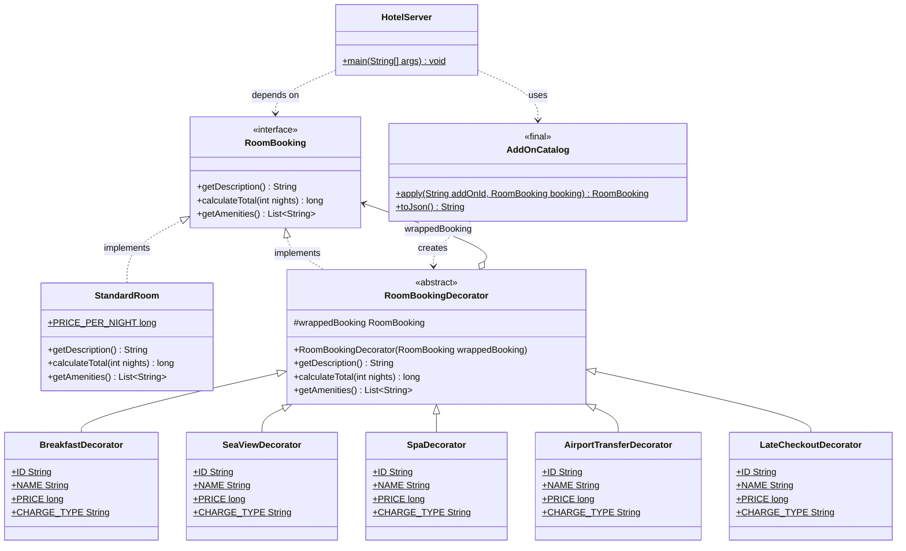

# Hotel Room Booking — Decorator Pattern

A small Java 17+ application that prices a hotel stay built from a base room plus
any combination of optional add-ons. The backend is plain Java (standard library
only, no Maven or Gradle) and serves a static HTML/CSS/JS frontend over a
built-in HTTP server. All prices are in Colombian pesos (COP) and are handled as
`long` values so no rounding error can creep in.

---

## 1. Case study

A hotel sells a standard room, and on top of it a set of extras that guests
combine freely: breakfast buffet, sea view upgrade, spa access, airport transfer
and late checkout. Some extras are charged for every night of the stay, others
only once per booking. Any guest may pick none of them, all of them, or anything
in between.

**Why inheritance does not work here.** If every valid combination needed its own
class, we would need one subclass per subset of the 5 add-ons:

```
StandardRoomWithBreakfast
StandardRoomWithBreakfastAndSpa
StandardRoomWithBreakfastAndSpaAndSeaView
StandardRoomWithSeaViewAndLateCheckout
... and so on
```

With 5 add-ons there are 2^5 = **32 combinations**, so up to 32 subclasses — and
the count doubles with every new extra the hotel decides to sell. A sixth add-on
would mean 64 classes. The combinations are also fixed at compile time, so the
hotel could not enable an extra without a new release.

**What Decorator gives us.** We write **one class per add-on — 5 classes, not
32** — and compose them at runtime, in any order, as many as the guest selects:

```java
RoomBooking booking = new StandardRoom();
booking = new BreakfastDecorator(booking);
booking = new SpaDecorator(booking);
```

Adding a sixth add-on means writing exactly one new class. Nothing else about the
pricing model changes.

---

## 2. The Decorator pattern

Decorator attaches extra responsibilities to an object dynamically by wrapping it
in another object that shares its interface. The wrapper holds a reference to the
object it wraps, forwards the calls to it, and adds its own contribution to the
result on the way back out.

The key move is that **the wrapper implements the same interface as the thing it
wraps**. That is what lets wrappers wrap other wrappers: a chain of five
decorators around a room is still, to any client, just a `RoomBooking`.

In this project a call travels inward to the `StandardRoom` and the answer is
built up as it returns outward:

```
SpaDecorator.calculateTotal(3)
    └─> BreakfastDecorator.calculateTotal(3)
            └─> StandardRoom.calculateTotal(3)  ->  540 000
        + 35 000 x 3 nights                     ->  645 000
    + 90 000 once                               ->  735 000
```

### Roles mapped to our classes

| Pattern role | Our class | Responsibility in this project |
| --- | --- | --- |
| **Component** | `hotel.model.RoomBooking` | The interface shared by rooms and add-ons: `getDescription()`, `calculateTotal(int nights)`, `getAmenities()`. |
| **ConcreteComponent** | `hotel.model.StandardRoom` | The plain room with no extras. Innermost layer of every chain; the only class that knows the nightly room rate. |
| **Decorator** | `hotel.decorators.RoomBookingDecorator` | Abstract base of all add-ons. Implements `RoomBooking` *and* holds a `RoomBooking` (`wrappedBooking`). Delegates every method by default. |
| **ConcreteDecorator** | `BreakfastDecorator`, `SeaViewDecorator`, `SpaDecorator`, `AirportTransferDecorator`, `LateCheckoutDecorator` | One add-on each. Appends its name to the description, its charge to the total and its amenity to the list. |
| **Client** | `hotel.server.HotelServer` (helped by `hotel.decorators.AddOnCatalog`) | Reads the requested add-on ids, builds the chain, and reports the result as JSON. It only ever talks to the `RoomBooking` interface. |

`AddOnCatalog` is not part of the classic pattern. It is a small factory that maps
a string id coming from the HTTP request to the matching decorator, so the server
never names a concrete decorator class.

### The add-ons

| Add-on | id | Price (COP) | Charge | Amenity added |
| --- | --- | --- | --- | --- |
| Breakfast Buffet | `breakfast` | 35 000 | per night | Daily breakfast buffet |
| Sea View Upgrade | `sea-view` | 50 000 | per night | Sea view balcony |
| Spa Access | `spa` | 90 000 | one time | Spa circuit access |
| Airport Transfer | `airport-transfer` | 60 000 | one time | Round-trip airport transfer |
| Late Checkout | `late-checkout` | 40 000 | one time | Checkout until 3:00 PM |

Base room: **180 000 COP per night**.

---

## 3. UML class diagram



The important edge is `RoomBookingDecorator o--> RoomBooking`: the decorator both
*implements* the interface and *holds* one. That double relationship is the whole
pattern.

---

## 4. Example of wrapping

```java
import hotel.model.RoomBooking;
import hotel.model.StandardRoom;
import hotel.decorators.BreakfastDecorator;
import hotel.decorators.SpaDecorator;

RoomBooking booking = new SpaDecorator(new BreakfastDecorator(new StandardRoom()));

booking.getDescription();    // "Standard Room + Breakfast Buffet + Spa Access"
booking.calculateTotal(3);   // 735000
booking.getAmenities();      // [Double bed, Private bathroom, Wi-Fi,
                             //  Daily breakfast buffet, Spa circuit access]
```

How the total for 3 nights is reached:

| Layer | Charge | Amount (COP) | Running total |
| --- | --- | --- | --- |
| `StandardRoom` | 180 000 x 3 nights | 540 000 | 540 000 |
| `BreakfastDecorator` | 35 000 x 3 nights | 105 000 | 645 000 |
| `SpaDecorator` | 90 000 once | 90 000 | **735 000** |

Read the constructor call from the inside out: `StandardRoom` is the innermost
layer, `SpaDecorator` the outermost. Since every layer only adds to what it
received, the order of the wrappers does not change the total — only the order in
which names and amenities appear.

The same chain is normally built in a loop, which is how the server does it:

```java
RoomBooking booking = new StandardRoom();
for (String addOnId : requestedAddOns) {
    booking = AddOnCatalog.apply(addOnId, booking);
}
```

Note that `getAmenities()` hands back a fresh `ArrayList` on every call, so an
outer decorator appending its amenity can never corrupt the layers underneath it.

---

## 5. Project structure

```
TallerPatrones-Decorator/
├── README.md
├── .gitignore
├── run.sh                      # build + run on Linux / macOS
├── run.bat                     # build + run on Windows
├── backend/
│   └── src/
│       └── hotel/
│           ├── model/
│           │   ├── RoomBooking.java              # Component
│           │   └── StandardRoom.java             # ConcreteComponent
│           ├── decorators/
│           │   ├── RoomBookingDecorator.java     # Decorator (abstract)
│           │   ├── BreakfastDecorator.java       # ConcreteDecorator
│           │   ├── SeaViewDecorator.java         # ConcreteDecorator
│           │   ├── SpaDecorator.java             # ConcreteDecorator
│           │   ├── AirportTransferDecorator.java # ConcreteDecorator
│           │   ├── LateCheckoutDecorator.java    # ConcreteDecorator
│           │   └── AddOnCatalog.java             # factory: id -> decorator
│           └── server/
│               └── HotelServer.java              # Client + HTTP API
├── frontend/
│   ├── index.html
│   ├── styles.css
│   └── app.js
└── out/                        # compiled .class files (generated, not committed)
```

---

## 6. Requirements and how to run

**Requirements**

- JDK 17 or newer (`javac -version` to check). No Maven, no Gradle, no external
  libraries — only the Java standard library, including the bundled
  `com.sun.net.httpserver`.
- Any modern browser.
- Port 8080 free.

**Always run the commands from the repository root.** The server resolves the
frontend files relative to the working directory, so starting it from anywhere
else gives 404s for the HTML, CSS and JS.

### Windows

```bat
run.bat
```

or manually:

```bat
javac -d out backend\src\hotel\model\*.java backend\src\hotel\decorators\*.java backend\src\hotel\server\*.java
java -cp out hotel.server.HotelServer
```

### Linux / macOS

```bash
./run.sh
```

(first time only: `chmod +x run.sh`)

or manually:

```bash
javac -d out backend/src/hotel/model/*.java backend/src/hotel/decorators/*.java backend/src/hotel/server/*.java
java -cp out hotel.server.HotelServer
```

Then open <http://localhost:8080>. Stop the server with `Ctrl+C`.

**Troubleshooting**

| Symptom | Cause and fix |
| --- | --- |
| `Address already in use` | Another process holds port 8080. Stop it, or change the port in `HotelServer`. |
| Page loads but is unstyled / empty | The server was not started from the repository root. Restart it from there. |
| `class file has wrong version` | The JDK is older than 17. Install a newer JDK. |
| Code changes have no effect | `javac` was not re-run. Recompile, then restart the server. |

---

## 7. API reference

The server answers `GET` requests only. Any other method returns
`405 Method Not Allowed`.

### `GET /` , `GET /styles.css` , `GET /app.js`

Serves the static frontend from `./frontend`. `GET /` returns `index.html`.

### `GET /api/addons`

Returns the catalog of available add-ons, generated by `AddOnCatalog.toJson()`.
The frontend builds its checkbox list from this response, which is why adding an
add-on on the backend needs no frontend change.

```json
[
  {"id":"breakfast","name":"Breakfast Buffet","price":35000,"chargeType":"PER_NIGHT"},
  {"id":"sea-view","name":"Sea View Upgrade","price":50000,"chargeType":"PER_NIGHT"},
  {"id":"spa","name":"Spa Access","price":90000,"chargeType":"ONE_TIME"},
  {"id":"airport-transfer","name":"Airport Transfer","price":60000,"chargeType":"ONE_TIME"},
  {"id":"late-checkout","name":"Late Checkout","price":40000,"chargeType":"ONE_TIME"}
]
```

### `GET /api/booking`

Builds a decorator chain and prices it.

| Parameter | Required | Description |
| --- | --- | --- |
| `nights` | yes | Number of nights, an integer from **1 to 30**. |
| `addOns` | no | Comma-separated add-on ids. Omit it or leave it empty for a bare room. |

**Example — `GET /api/booking?nights=3&addOns=breakfast,spa`**

```json
{
  "description": "Standard Room + Breakfast Buffet + Spa Access",
  "nights": 3,
  "total": 735000,
  "amenities": [
    "Double bed",
    "Private bathroom",
    "Wi-Fi",
    "Daily breakfast buffet",
    "Spa circuit access"
  ],
  "layers": ["StandardRoom", "BreakfastDecorator", "SpaDecorator"]
}
```

`layers` lists the class simple names of the chain from innermost to outermost,
so the response shows the object graph that produced the price.

**Example — `GET /api/booking?nights=2` (no add-ons)**

```json
{
  "description": "Standard Room",
  "nights": 2,
  "total": 360000,
  "amenities": ["Double bed", "Private bathroom", "Wi-Fi"],
  "layers": ["StandardRoom"]
}
```

**Example — `GET /api/booking?nights=5&addOns=sea-view,airport-transfer`**

```json
{
  "description": "Standard Room + Sea View Upgrade + Airport Transfer",
  "nights": 5,
  "total": 1210000,
  "amenities": [
    "Double bed",
    "Private bathroom",
    "Wi-Fi",
    "Sea view balcony",
    "Round-trip airport transfer"
  ],
  "layers": ["StandardRoom", "SeaViewDecorator", "AirportTransferDecorator"]
}
```

(900 000 room + 250 000 sea view + 60 000 transfer.)

**Errors** — returned with HTTP status `400` and an `error` field:

```json
{"error": "nights must be between 1 and 30"}
```

| Situation | Status |
| --- | --- |
| `nights` missing, not a number, or outside 1–30 | `400` |
| Unknown add-on id | `400` |
| The same add-on id listed twice | `400` |
| Unknown path | `404` |
| Method other than `GET` | `405` |

Duplicates are rejected on purpose: wrapping the same decorator twice would
silently charge the guest twice for one extra.

---

## 8. How to add a new add-on in 3 steps

Say the hotel starts selling a minibar at 25 000 COP per night.

**Step 1 — create the decorator** in `backend/src/hotel/decorators/MinibarDecorator.java`:

```java
package hotel.decorators;

import hotel.model.RoomBooking;

import java.util.List;

/**
 * ConcreteDecorator that adds a stocked minibar to a booking.
 */
public class MinibarDecorator extends RoomBookingDecorator {

    public static final String ID = "minibar";
    public static final String NAME = "Minibar";
    public static final long PRICE = 25_000;
    public static final String CHARGE_TYPE = "PER_NIGHT";

    public MinibarDecorator(RoomBooking wrappedBooking) {
        super(wrappedBooking);
    }

    @Override
    public String getDescription() {
        return wrappedBooking.getDescription() + " + " + NAME;
    }

    @Override
    public long calculateTotal(int nights) {
        return wrappedBooking.calculateTotal(nights) + PRICE * nights;
    }

    @Override
    public List<String> getAmenities() {
        List<String> amenities = super.getAmenities();
        amenities.add("Stocked minibar");
        return amenities;
    }
}
```

Use `PRICE * nights` for a per-night add-on, or just `PRICE` for a one-time one.
Always start `getAmenities()` from `super.getAmenities()` — that is the defensive
copy.

**Step 2 — register it in `AddOnCatalog`**: add a branch to `apply()` matching
`MinibarDecorator.ID`, and add the corresponding entry to `toJson()`.

**Step 3 — recompile and restart**:

```bash
javac -d out backend/src/hotel/model/*.java backend/src/hotel/decorators/*.java backend/src/hotel/server/*.java
java -cp out hotel.server.HotelServer
```

**No frontend change is needed.** `app.js` fetches `/api/addons` and renders
whatever the catalog returns, so the new checkbox appears on its own. No existing
class is modified either — that is the Open/Closed Principle in practice.

---

## 9. Advantages and disadvantages

### Advantages in this project

- **No combinatorial explosion.** 5 classes instead of up to 32, and the figure
  grows linearly rather than doubling with each new add-on.
- **Composition at runtime.** The guest's selection arrives as a list of strings
  in an HTTP request and the object graph is built from it on the spot. No
  combination has to be anticipated at compile time.
- **Open/Closed in practice.** A new add-on is a new file. `StandardRoom` and
  `RoomBookingDecorator` have not changed since they were written.
- **Single responsibility.** Each decorator knows one price, one name and one
  amenity. The breakfast rules live in exactly one file.
- **The client stays simple.** `HotelServer` only ever sees `RoomBooking`, so one
  loop prices a bare room and a fully loaded suite alike.

### Disadvantages

- **Many small classes.** Five near-identical files; a reader has to open several
  to see the full picture.
- **Hard to debug.** A wrong total means stepping through a chain of nested
  objects. The `layers` field in the API response exists precisely to make the
  chain visible.
- **No way to query a single layer.** Asking "does this booking include a spa?"
  means walking the chain or re-reading the ids, because once wrapped, a layer is
  hidden behind the interface.
- **Order can matter.** It does not here, because every charge is additive. The
  moment a percentage discount or a tax layer is introduced, wrapping order
  starts to change the result and must be fixed deliberately.
- **Identity is lost.** The outermost object is not a `StandardRoom`, so
  `instanceof` checks and `equals` comparisons against the base type fail.
- **Duplication across decorators.** The five classes repeat nearly the same
  three overrides, differing only in constants.

### When a different pattern would fit better

If add-ons were mutually exclusive variants of one feature (a room category, say)
Strategy would be the better fit. If the goal were assembling one valid booking
step by step with validation at the end, Builder would. Decorator is right here
specifically because the extras are **independent and freely combinable**.

---

## 10. Team

| Member | Part | Scope |
| --- | --- | --- |
| **[Member 1]** | Part 1 — Core model and documentation | `RoomBooking`, `StandardRoom`, `RoomBookingDecorator`, `README.md` |
| **[Member 2]** | Part 2 — Concrete decorators and catalog | `BreakfastDecorator`, `SeaViewDecorator`, `SpaDecorator`, `AirportTransferDecorator`, `LateCheckoutDecorator`, `AddOnCatalog` |
| **[Member 3]** | Part 3 — HTTP server, frontend and run scripts | `HotelServer`, `frontend/index.html`, `frontend/styles.css`, `frontend/app.js`, `run.sh`, `run.bat`, `.gitignore` |

Each part was developed in parallel against the shared contract documented above:
the `RoomBooking` interface, the add-on constants (`ID`, `NAME`, `PRICE`,
`CHARGE_TYPE`) and the JSON shapes in section 7. Anyone extending the project
should keep those three fixed, since all three parts depend on them.
